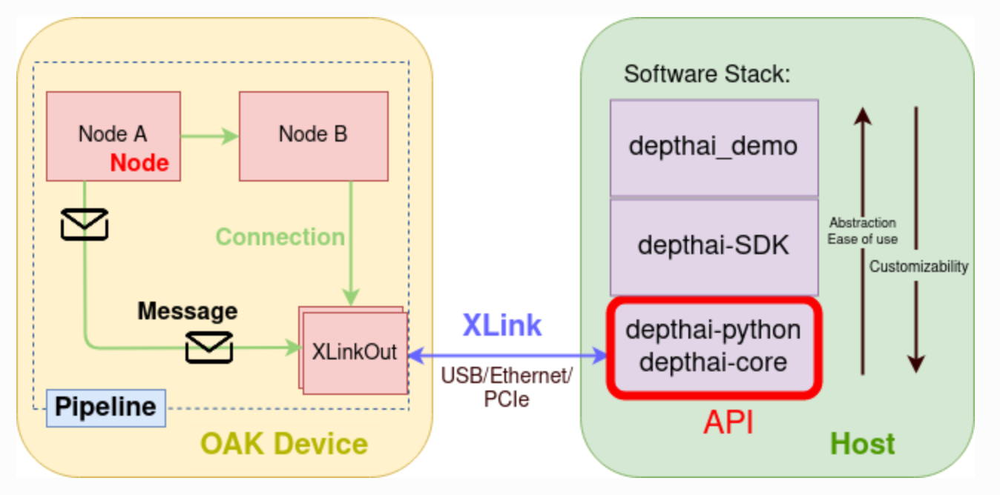
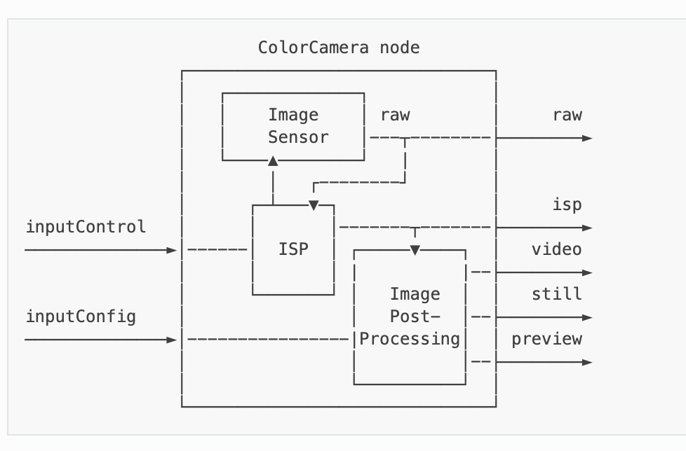
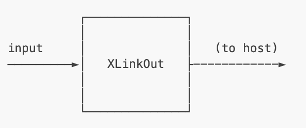
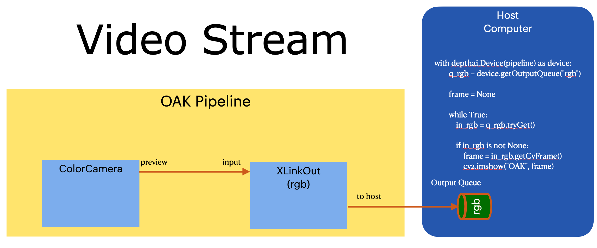

# Using the OpenCV AI DepthAI API to create a simple video feed of the OAK-1 device

This repo contains the simplest of all examples to fire up the OAK-1 and see a video feed.

The best place to start is with the [Luxonis Documentation](https://docs.luxonis.com/projects/api/en/latest/).

The souce for the DepthAI API/SDK can be found on their [Github repo](https://github.com/luxonis/depthai)

The figure below is from the Luxonis DepthAI API documentation.



There are 2 compute devices:

* The OAK-1

* Host Computer

You defined the image processing that happens on the OAK using a processing pipeline metaphore.  You define the nodes of a pipeline, and then the last node is an 'XLinkOut' which will send data to the host computer.

For the very simple videostream example we will need 2 nodes:

* [ColorCamera](https://docs.luxonis.com/projects/api/en/latest/components/nodes/color_camera/)

* [XLinkOut](https://docs.luxonis.com/projects/api/en/latest/components/nodes/xlink_out/)

### ColorCamera Node



The ColorCamera node has a number of outputs, but the one we are interested in is labeled 'preview'.  The preview output is suitable for smaller, preview like windows.  The 'video' output is suitable for larger, better quality video.

We will be using the preview output.

### XLinkOut Node



The XLinkOut node only has a single input, called 'input', and an output the implicitly send the contents to the host computer to a queue on the host computer.  It is from this queue that the host application will read from to get new frames.

### Video Stream Pipeline

The video stream script pipeline looks like the following:



We will create the two nodes, connect the 'preview' output of the ColorCamera Node to the 'input' input of the XLinkOut Node, and have the python script read frames from the internal queue.

The frames can then be displayed using OpenCV and the `imshow` method.


## Setup

```shell
pip install -r requirements
```

## Execute

```shell
python videostream.py
```

A window should appear showing the video stream


 
